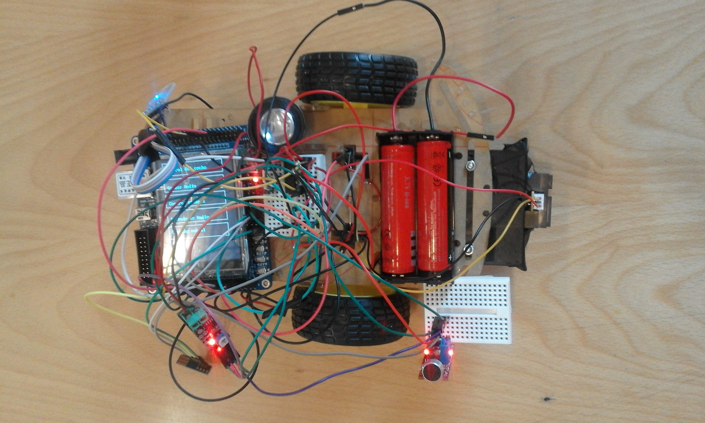
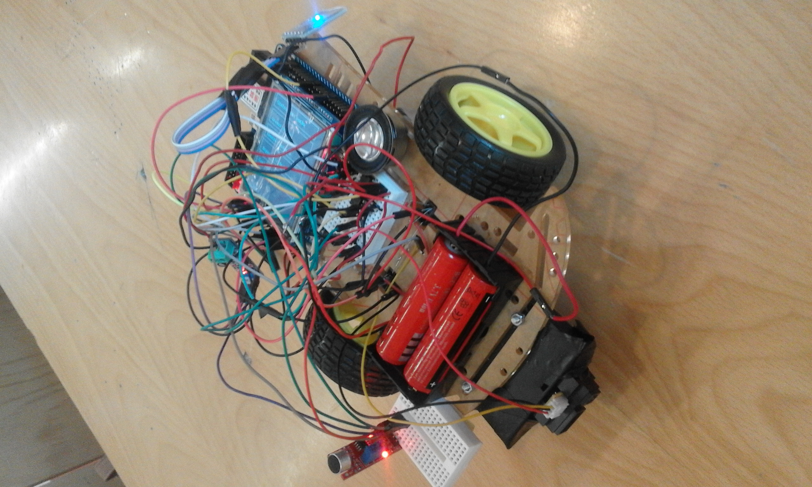

## Sistemas electrónicos digitales avanzados

 

> Autores: Javier López y Antonio Sanz

 

#### Introducción

En el siguiente documentado se explica el desarrollo del proyecto final de la asignatura
de Sistemas electrónicos digitales avanzados. El proyecto consiste en la realización de
un robot espía capaz de realizar diversas funciones que explicaremos más adelante.
Primero explicaremos el funcionamiento general del robot, a continuación haremos
una descripción de Hardware aportando esquemas de bloques donde mostremos los
pines que hayamos utilizado en nuestro diseño. También adjuntaremos el software
con todas las funciones explicadas, comentadas y con esquemas de tipo state chart.
Por ultimo haremos un análisis de ejecutabilidad de todas las tareas que realice
nuestro robot. Se añadirá también un manual de usuario que muestre el uso de todas
las aplicaciones con las que cuenta el robot diseñado.

 

